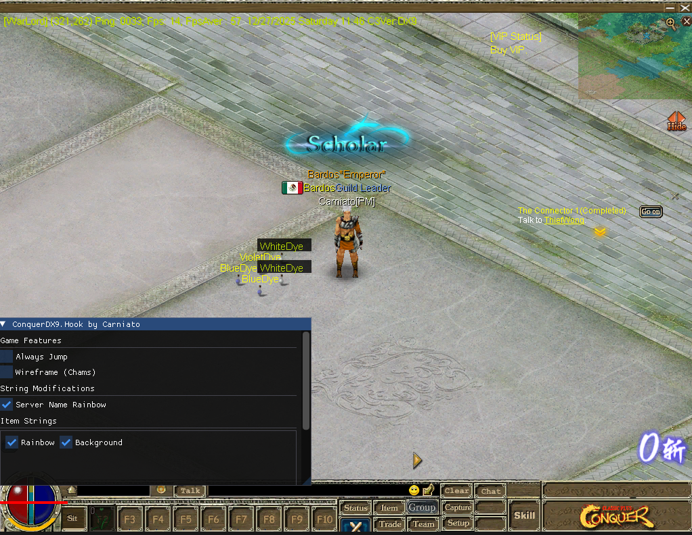

# ConquerDX9.Hook

DirectX9 hooking for Conquer Online with ImGui overlay

## Info

- Tested on Conquer Online game versions
- Compile on Release & x86
- Uses MinHook for function hooking
- ImGui overlay (toggle with INSERT key)
- Features: Always Jump, Wireframe/Chams, String modification, Memory Scanner

## Memory Scanner

Because the DLL runs inside the game process, the scanner reads and writes
memory directly (no `OpenProcess`/`ReadProcessMemory` needed). It works like
a minimal Cheat Engine built into the overlay:

1. Open the overlay with INSERT and scroll to **Memory Scanner**.
2. Pick a value type (Int32, UInt32, Float, Double, Byte, Int16, Int64),
   type the current value (e.g. your HP), and press **First Scan**.
3. Change the value in-game (lose HP, spend gold, ...), enter the new value
   (or pick Changed/Increased/Decreased), and press **Next Scan**.
4. Repeat until few addresses remain, click one in the results list, enter a
   new value and press **Write** (or **Freeze** to rewrite it every frame).

Notes:

- Scans walk `MEM_COMMIT` regions with read/write access via `VirtualQuery`,
  at natural alignment (4 bytes for Int32/Float, etc.).
- First scans are capped at 2,000,000 matches; refine with Next Scan.
- Results list shows at most 2,000 rows to keep the UI responsive.
- Frozen values are re-applied every frame, even while the menu is closed.

## Building

1. Select Release configuration and x86 platform
2. Build the solution
3. Output: `Release/Chat.dll`

## Usage

### Version 6609 (Proxy Method)

1. Rename original `Chat.dll` to `OChat.dll` in the game'folder
2. Copy compiled `Chat.dll` to the same folder
3. Launch the game (no injector needed)
4. Press INSERT to toggle ImGui interface

### Other Versions (DLL Injection)

1. Remove proxy code from `src/hooks/proxy.cpp` and `src/dllmain.cpp`
2. Compile as regular DLL
3. Inject the DLL into the game process
4. Press INSERT to toggle ImGui interface

## Credits

Based on examples and concepts from [co-stuff/posts](https://github.com/co-stuff/posts)

## Libraries

- [MinHook](https://github.com/TsudaKageyu/minhook) (included)
- [ImGui](https://github.com/ocornut/imgui) (included)
